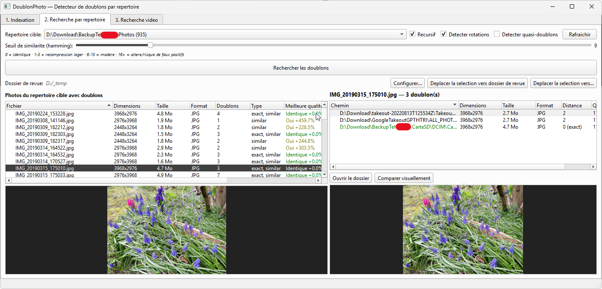
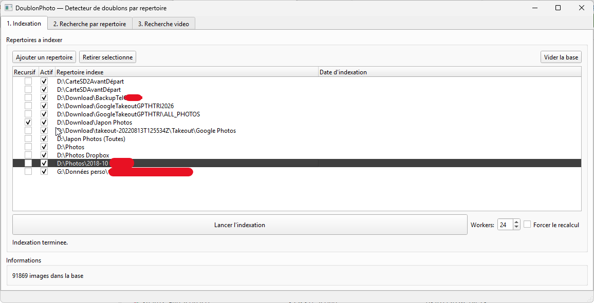
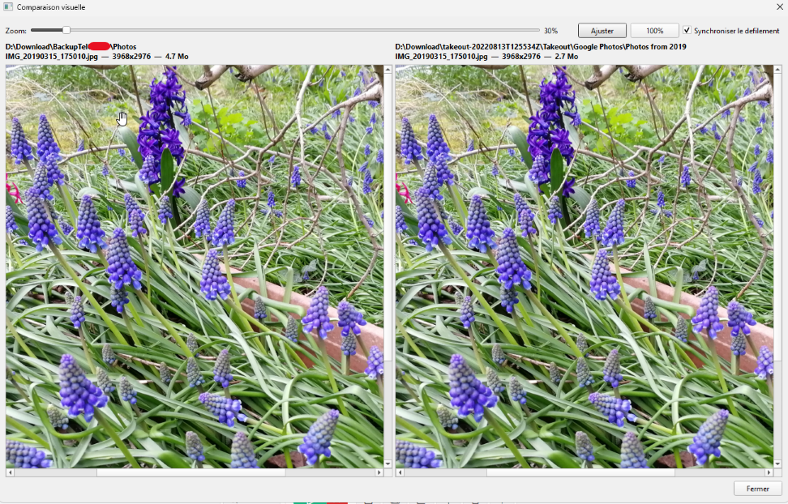

# Duplicate_photo_stuff
identifier facilement vos photos et vidéos en doublons. Permet surtout de trier 1 répertoire vis à vis du catalogue total.
il y a plein d'autres programmes qui marchent tres bien permettant de repérer les doublons, mais je n'en ai trouvé aucun qui permette de comparer spécifiquement 1 répertoire vis à vis du catalogue total.


Application de bureau (normalement multiplateforme, utilisé seulement sous Windows) pour **détecter et supprimer les photos et vidéos en double** dans une collection répartie sur plusieurs disques, sauvegardes, exports Google Takeout, cartes SD, etc.

Contrairement à un simple comparateur de fichiers, DoublonPhoto utilise des **hashes perceptuels** : il détecte non seulement les copies bit-à-bit identiques, mais aussi les mêmes photos réencodées, redimensionnées, recompressées, tournées ou légèrement recadrées.

---

## Sommaire

- [Fonctionnalités](#fonctionnalités)
- [Comment ça marche](#comment-ça-marche)
- [Installation](#installation)
- [Mode d'emploi](#mode-demploi)
  - [Onglet 1 — Indexation](#onglet-1--indexation)
  - [Les cases « Récursif » et « Actif »](#les-cases--récursif--et--actif-)
  - [Onglet 2 — Recherche de doublons photo](#onglet-2--recherche-de-doublons-photo)
  - [Onglet 3 — Recherche de doublons vidéo](#onglet-3--recherche-de-doublons-vidéo)
- [Comprendre le seuil de similarité](#comprendre-le-seuil-de-similarité)
- [Workflow recommandé](#workflow-recommandé)
- [Structure du projet](#structure-du-projet)
- [FAQ](#faq)

---

## Fonctionnalités

### Détection
- **Doublons exacts** : comparaison SHA-256 (fichiers strictement identiques).
- **Doublons perceptuels** : comparaison de hash perceptuel (pHash 16×16) via la distance de Hamming. Détecte les réencodages JPEG, changements de qualité, redimensionnements, modifications de métadonnées.
- **Doublons pivotés** : détection des images tournées de 90°, 180° ou 270° (hashes de rotation pré-calculés à l'indexation).
- **Quasi-doublons** : photos de la même scène prises à quelques secondes/minutes d'intervalle, identifiées via la date EXIF de prise de vue + comparaison d'histogrammes de couleurs.
- **Doublons vidéo** : échantillonnage de frames réparties sur toute la durée de la vidéo, pHash sur chaque frame, comparaison de la distance moyenne (avec contrôle de cohérence de durée).
- **Correction d'orientation EXIF** automatique avant hachage.

### Analyse et tri
- Colonne **« Meilleure qualité »** indiquant quelle copie conserver, avec l'écart de taille en pourcentage (ex. `Oui +8.2%`).
- Affichage des dimensions, taille, format, durée (vidéos) et distance de similarité pour chaque doublon.
- Tri insensible à la casse sur toutes les colonnes.
- **Comparaison visuelle côte à côte** avec zoom (molette ou curseur) et défilement synchronisé.

### Actions
- Déplacement des doublons sélectionnés vers un **dossier de revue** configurable, ou vers n'importe quel répertoire, avec gestion des conflits (remplacer / renommer / ignorer) et barre de progression.
- **Couper vers le presse-papiers** (`Ctrl+X`) pour coller ensuite dans l'Explorateur Windows.
- Menu contextuel : ouvrir le répertoire du fichier, copier le chemin, couper.
- Double-clic pour ouvrir un fichier avec l'application par défaut.

### Indexation
- Indexation **multi-processus** (nombre de workers configurable) avec pause/reprise.
- Indexation **incrémentale** : les fichiers déjà en base et inchangés (même taille) sont ignorés.
- Nettoyage automatique des fichiers disparus du disque (orphelins).
- Formats images : JPEG, PNG, WebP, BMP, TIFF, GIF, HEIC/HEIF, AVIF, RAW (CR2, NEF, ARW, DNG, RAF, ORF, RW2, PEF, SRW), et plus.
- Formats vidéo : MP4, MOV, AVI, MKV, M4V, WMV, 3GP, WebM, MPG/MPEG, FLV, MTS, M2TS.

---

## Comment ça marche

1. **Indexation** — chaque fichier est parcouru une seule fois. L'application calcule et stocke en base SQLite locale (`doublons.db`) :
   - le SHA-256 du fichier,
   - le hash perceptuel (pHash) de l'image (ou des frames pour une vidéo),
   - les hashes des versions tournées à 90°/180°/270°,
   - les dimensions, la taille, le format, la date EXIF de prise de vue.

2. **Recherche** — la recherche ne relit **jamais** les fichiers sur le disque : elle compare uniquement les hashes stockés en base, avec des opérations vectorisées NumPy. C'est ce qui la rend quasi instantanée même sur des dizaines de milliers de photos.

3. **Principe de la recherche** — on choisit un **répertoire cible** ; l'application liste les fichiers de ce répertoire qui possèdent au moins un doublon **ailleurs** dans la base. L'idée est de répondre à : *« que puis-je supprimer de ce dossier, sachant que c'est déjà présent ailleurs ? »*

---

## Installation

### Prérequis
- Python 3.10 ou supérieur

### Étapes

```bash
git clone https://github.com/<votre-compte>/DoublonPhoto.git
cd DoublonPhoto
python -m venv .venv
.venv\Scripts\activate
pip install -r requirements.txt
python main.py
```

### Dépendances

| Paquet | Rôle |
|---|---|
| `PySide6` | Interface graphique Qt |
| `Pillow` | Lecture des images, EXIF, rotation |
| `imagehash` | Calcul des hashes perceptuels (pHash) |
| `numpy` | Comparaison vectorisée des hashes |
| `opencv-python-headless` | Extraction des frames vidéo |

---

## Mode d'emploi

### Onglet 1 — Indexation

C'est le point de départ obligatoire : **rien ne peut être détecté tant que les répertoires n'ont pas été indexés.**

1. Cliquer sur **« Ajouter un répertoire »** et choisir un dossier contenant des photos/vidéos. Répéter pour tous les emplacements à analyser (disque photo, sauvegardes, export Takeout, carte SD…).
2. Cocher/décocher **Récursif** et **Actif** selon le besoin (voir section ci-dessous).
3. Régler le nombre de **Workers** (processus parallèles). Une valeur autour du nombre de cœurs du CPU est un bon point de départ (16 par défaut).
4. Cliquer sur **« Lancer l'indexation »**. Le bouton **Pause** permet d'interrompre et de reprendre à tout moment.
5. Le compteur en bas indique le nombre d'images présentes en base.

Autres boutons :
- **Retirer sélectionné** : retire le répertoire et supprime ses fichiers de la base (n'efface rien sur le disque).
- **Vider la base** : réinitialise complètement l'index (n'efface rien sur le disque).
- **Forcer le recalcul** : voir la [FAQ](#faq).

> L'indexation est incrémentale : relancer l'indexation ne retraite que les fichiers nouveaux ou modifiés. Les fichiers disparus du disque sont automatiquement retirés de la base.

---

### Les cases « Récursif » et « Actif »

Ces deux cases se trouvent devant chaque répertoire de la liste de l'onglet 1. **Elles ne servent pas à la même chose** et leur état est sauvegardé en base (il persiste entre les sessions).

#### ☑ Récursif — *« jusqu'où descendre lors de l'indexation ? »*

Contrôle **le parcours des sous-dossiers au moment de l'indexation**.

| État | Effet |
|---|---|
| **Coché** | Tous les sous-répertoires (à tous les niveaux) sont parcourus et indexés. |
| **Décoché** | Seuls les fichiers directement présents dans le répertoire sont indexés ; les sous-dossiers sont ignorés. |

**Exemple** — avec `D:\Photos` contenant `D:\Photos\2023\` et `D:\Photos\2024\` :
- Récursif **coché** → les photos de `2023` et `2024` sont indexées.
- Récursif **décoché** → seules les photos posées à la racine de `D:\Photos` sont indexées ; celles de `2023` et `2024` sont invisibles pour l'application.

*À utiliser quand* : vous voulez ajouter une arborescence complète (coché), ou au contraire n'indexer qu'un niveau précis en ajoutant manuellement quelques sous-dossiers choisis (décoché).

> Modifier cette case ne change rien tant que vous ne relancez pas l'indexation.

#### ☑ Actif — *« ce répertoire participe-t-il à la recherche de doublons ? »*

Contrôle **l'inclusion du répertoire dans les résultats de recherche**, sans toucher à l'index.

| État | Effet |
|---|---|
| **Coché** | Le répertoire apparaît dans la liste déroulante « Répertoire cible » et ses fichiers peuvent être proposés comme doublons. |
| **Décoché** | Le répertoire est **totalement ignoré** par les onglets 2 et 3 : il disparaît de la liste déroulante et ses fichiers ne seront jamais listés comme doublons d'un autre fichier. Les données restent en base (aucune réindexation nécessaire pour le réactiver). |

**Exemple d'usage typique** — vous avez indexé `D:\Sauvegarde_NAS` mais vous ne voulez pas que ses fichiers polluent les résultats pendant que vous nettoyez `D:\Photos` : décochez **Actif** sur `D:\Sauvegarde_NAS`. Recochez-le plus tard, sans réindexer.

#### Résumé

| | Récursif | Actif |
|---|---|---|
| **Agit sur** | L'indexation (lecture disque) | La recherche (filtrage des résultats) |
| **Question posée** | *« Faut-il descendre dans les sous-dossiers ? »* | *« Faut-il tenir compte de ce dossier dans la recherche ? »* |
| **Effet immédiat** | Non — nécessite de relancer l'indexation | Oui — dès la recherche suivante |
| **Impact sur la base** | Ajoute/omet des fichiers en base | Aucun, les données sont conservées |

---

### Onglet 2 — Recherche de doublons photo

1. **Répertoire cible** : choisir dans la liste déroulante le dossier à nettoyer. Le nombre entre parenthèses indique le nombre de photos indexées dans ce dossier. Seuls les dossiers **Actifs** apparaissent.
2. Cocher les options souhaitées :
   - **Récursif** : inclure aussi les sous-dossiers du répertoire cible dans la recherche.
   - **Détecter rotations** : trouver aussi les copies pivotées de 90/180/270°.
   - **Détecter quasi-doublons** : trouver les photos de la même scène prises à moins de 2 minutes d'intervalle et visuellement très proches (nécessite une date EXIF valide).
3. Régler le **seuil de similarité** (voir section suivante).
4. Cliquer sur **« Rechercher les doublons »**.

**Lecture des résultats :**

- **Panneau de gauche** : les fichiers du répertoire cible ayant au moins un doublon ailleurs.
  - *Doublons* : nombre de copies trouvées.
  - *Type* : `exact` (SHA-256 identique, en vert), `similar` (pHash proche), `near` (quasi-doublon).
  - *Meilleure qualité* : `Oui +8.2%` signifie que ce fichier est le plus volumineux de son groupe, 8,2 % plus gros que la meilleure copie concurrente — c'est donc celui à conserver. `Non (autre copie meilleure)` indique qu'une copie de meilleure qualité existe ailleurs.
  - *Répertoire du doublon* : affiché quand il n'y a qu'un seul doublon, pour repérer l'emplacement d'un coup d'œil.
- **Panneau de droite** : la liste détaillée des doublons du fichier sélectionné, avec la **distance** de similarité (0 = identique).
- **Zones d'aperçu** en bas de chaque panneau (redimensionnables via les poignées). Double-clic pour ouvrir en taille réelle.
- **Comparer visuellement** : sélectionner un fichier à gauche et un doublon à droite pour ouvrir la vue côte à côte (zoom molette, défilement synchronisé).

**Agir sur les résultats :**

- Sélection multiple avec `Ctrl` / `Maj`.
- **Déplacer la sélection vers dossier de revue** : envoie les fichiers vers le dossier configuré (bouton *Configurer…*). Recommandé plutôt que la suppression directe : on garde la possibilité de revenir en arrière.
- **Déplacer la sélection vers…** : choisir la destination à la volée, avec gestion des conflits de noms.
- `Ctrl+X` ou clic droit → **Couper** : place les fichiers dans le presse-papiers Windows, à coller (`Ctrl+V`) dans l'Explorateur.
- Clic droit → **Ouvrir le répertoire** / **Copier le chemin du répertoire**.

---

### Onglet 3 — Recherche de doublons vidéo

Fonctionne selon le même principe que l'onglet 2.

1. Choisir le **répertoire cible** (le compteur indique le nombre de vidéos indexées).
2. Cocher **Récursif** si besoin.
3. Régler le **seuil de similarité** — il s'agit ici de la **distance de Hamming moyenne** entre les frames échantillonnées des deux vidéos.
4. Lancer la recherche.

Une paire de vidéos n'est retenue comme doublon que si les frames échantillonnées correspondent **et** que les durées sont proches (tolérance de 15 %). Cela évite qu'un extrait court soit confondu avec la vidéo complète.

Les aperçus affichent une image extraite du milieu de chaque vidéo. Le double-clic ouvre la vidéo dans le lecteur par défaut.

---

## Comprendre le seuil de similarité

Le seuil correspond à la **distance de Hamming** entre deux hashes perceptuels : le nombre de bits qui diffèrent. Plus la valeur est basse, plus les images doivent se ressembler pour être considérées comme doublons.

| Distance | Interprétation | Risque de faux positifs |
|---|---|---|
| **0** | Images visuellement identiques | Nul |
| **1 – 5** | Recompression légère, métadonnées modifiées, recadrage minime | Très faible |
| **6 – 15** | Recompression modérée, redimensionnement | Faible *(valeur par défaut : 10)* |
| **16 – 30** | Variantes fortement altérées | Élevé |
| **30+** | Images réellement différentes | Très élevé |

**En pratique** : commencer à 10. Si des doublons évidents ne sortent pas, monter progressivement à 15 ou 20 et vérifier visuellement les résultats. Descendre à 5 pour ne garder que les correspondances les plus sûres.

---

## Workflow recommandé

1. Indexer **tous** les emplacements concernés en une seule fois (onglet 1), y compris les sauvegardes.
2. Configurer un **dossier de revue** (par exemple `D:\A_SUPPRIMER`).
3. Choisir le répertoire à nettoyer en priorité (typiquement l'export Takeout ou une vieille sauvegarde) comme **répertoire cible**.
4. Lancer la recherche avec un seuil de 10.
5. Trier par la colonne **« Meilleure qualité »** : les lignes `Non (autre copie meilleure)` sont les candidates les plus sûres à écarter.
6. Vérifier quelques cas par **comparaison visuelle** avant de déplacer en masse.
7. Déplacer la sélection vers le dossier de revue.
8. Après vérification du dossier de revue, le supprimer manuellement.
9. Relancer l'indexation pour mettre la base à jour, puis passer au répertoire cible suivant.

> **Sécurité** : l'application ne supprime jamais de fichier. Elle ne fait que **déplacer** (ou couper vers le presse-papiers). La suppression définitive reste une action manuelle de votre part.

---

## Structure du projet

| Fichier | Rôle |
|---|---|
| `main.py` | Interface graphique PySide6 : les trois onglets, les workers de recherche, les dialogues de comparaison et de déplacement. |
| `indexer.py` | Parcours des répertoires, calcul des hashes (pHash, rotations, SHA-256), extraction EXIF, hachage vidéo via OpenCV, indexation multi-processus. |
| `db.py` | Couche SQLite : schéma, migrations, opérations CRUD sur les tables `images`, `videos` et `indexed_dirs`. |
| `requirements.txt` | Dépendances Python. |
| `doublons.db` | Base de données locale générée à l'exécution (non versionnée). |

---

## FAQ

**À quoi sert « Forcer le recalcul » ?**
Par défaut, l'indexation ignore les fichiers déjà en base dont la taille n'a pas changé. Avec cette option cochée, **tous** les fichiers des répertoires listés sont réanalysés intégralement, même inchangés. Utile après une mise à jour de l'algorithme de hachage (par exemple pour générer les hashes de rotation sur une base ancienne). C'est nettement plus long : à n'utiliser que ponctuellement.

**Une photo n'est pas détectée comme doublon, pourquoi ?**
Dans l'ordre : vérifier que **les deux** fichiers sont bien indexés (leur répertoire figure dans la liste de l'onglet 1, avec **Récursif** coché si le fichier est dans un sous-dossier) ; vérifier que le répertoire de l'autre copie est bien **Actif** ; puis augmenter le seuil de similarité ; enfin, activer **Détecter rotations** ou **Détecter quasi-doublons** selon le cas.

**Les fichiers supprimés du disque restent-ils en base ?**
Non. À chaque indexation, les entrées dont le fichier n'existe plus sur le disque sont automatiquement retirées de la base.

**Que devient `doublons.db-journal` ?**
C'est le fichier journal temporaire de SQLite, utilisé pour garantir l'intégrité des transactions. Il est créé et supprimé automatiquement.

**L'application supprime-t-elle des fichiers ?**
Jamais. Les seules opérations sur le disque sont des **déplacements** que vous déclenchez explicitement, toujours après confirmation.

**Puis-je indexer un disque réseau ou externe ?**
Oui, mais l'indexation sera plus lente (lecture réseau/USB). Si le disque est déconnecté lors d'une réindexation, ses fichiers seront considérés comme disparus et retirés de la base : décochez plutôt **Actif** ou retirez temporairement le répertoire de la liste avant de relancer une indexation.

---
## Captures d'écran

<p align="center">
  
  <br><em>Onglet 2 — Recherche de doublons photo : liste des fichiers avec doublons, détail des copies et aperçus</em>
</p>

<details>
<summary><b>Voir les autres captures</b></summary>

<p align="center">
  
  <br><em>Onglet 1 — Indexation : gestion des répertoires avec les cases Récursif et Actif</em>
</p>

<p align="center">
  
  <br><em>Comparaison visuelle côte à côte : zoom à la molette et défilement synchronisé</em>
</p>

</details>

---

## Licence

Projet personnel distribué en l'état, sans garantie.
Développé avec Claude Code 5

